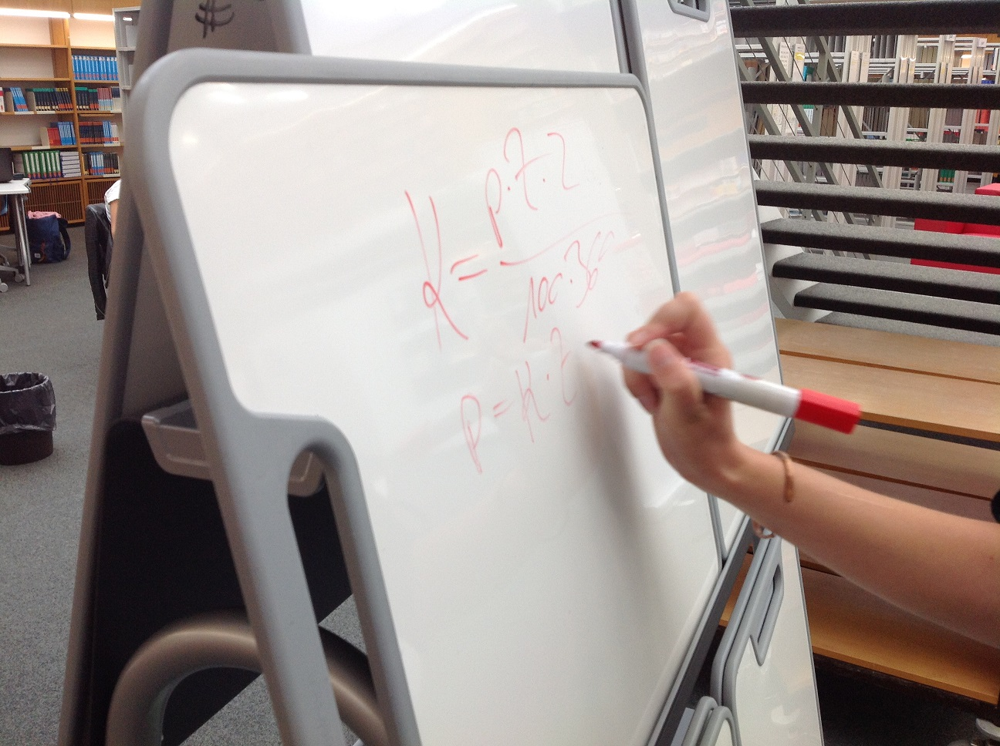

# 1. Eine neue Pädagogik schaffen

**In Kürze**

- Wie beeinflusst die Art und Weise der Gestaltung des physischen Raums das Lernen im Raum?
- aktuelle Trends in Lern- und Lehrpraxis
- Notwendigkeit einer Reihe von Leitprinzipien für die Gestaltung von Lernräumen

**Erwartungen an die Lektüre dieses Abschnitts**

Viele Fachleute, die mit der Gestaltung und dem Aufbau von Lernräumen zu tun haben, haben selbst weder einen Hintergrund von Lehr- und Lernpraxis noch stehen sie in direktem Kontakt mit Endnutzenden und Interessensgruppen. Das hat zur Folge, dass wir zu oft verbesserte Versionen von dem bauen, was wir schon haben, anstatt die Annahmen unter denen Lernräume entworfen werden tiefergehend in Frage zu stellen. Sogar Lehrende sind sich möglicherweise nicht in vollem Umfang der Auswirkungen bewusst wie die gebaute Umwelt die Art der Aktivitäten beschränkt, die stattfinden können. Das Ziel dieses Abschnitts ist deshalb, einen kurzen Überblick zu geben, was allgemein als „Good Practice“ im Bereich des Lernens und Lehrens angesehen wird und diejenigen, die sich mit der Gestaltung von Lernräumen beschäftigen, einzuladen schon in einem sehr frühen Stadium darüber nachzudenken, welche Art von Lern- und Lehrerlebnis sie für die Zukunft schaffen wollen.

&copy; N.Schanz / Universitätsbibliothek Tübingen
{: .fs-2 .text-right}

Vorschläge:
- Designentscheidungen sollten durch eine Reihe didaktischer Prinzipien geleitet sein. Diese Prinzipien klar und einfach zu formulieren wird den Dialog und das Verständnis zwischen verschiedenen, an einem Lernraumprojekt Beteiligten fördern.
- Wir müssen für eine Vielfalt didaktischer Ansätze entwerfen und dabei die stark vorherrschende Tendenz hin zu einem sozio-konstruktivistischen Ansatz[^1]  beachten, die partizipatorische und kollaborative Aktivitäten betont, wo immer diese möglich sind.
- Wir müssen über den gesamten Campus als Lernort nachdenken und den nahtlosen Übergang verschiedener Arten von Lernaktivitäten sowie die gesamte Bandbreite des Angebots berücksichtigen.

>_“Wir müssen also anfangen, nicht zu fragen: ‚Welche Gebäude wollen wir?‘, sondern: ‚Welche Art von Bildung wollen wir in Zukunft sehen?‘ Wir sollten nicht fragen: ‚Wie viele Klassenzimmer brauchen wir?‘, sondern: ‚Welche Art von Lernbeziehungen wollen wir fördern? Welche Kompetenzen sollen die Lernenden entwickeln? Welche Hilfsmittel und Ressourcen stehen uns zur Verfügung, um das Lernen zu unterstützen?’”_ (Rudd et al., 2006)
{: .fs-4 .fw-300 }

---

[^1]: Soziokonstruktivismus - ein pädagogischer Ansatz, der die
    Auswirkungen von Kommunikation, Zusammenarbeit und Aushandeln auf
    das Denken und Lernen betont. Die Studierenden sind aktiv an ihrem
    eigenen Lernen beteiligt - ein Prozess der Peer-Interaktion, der von
    einem Tutor begleitet und strukturiert wird.
