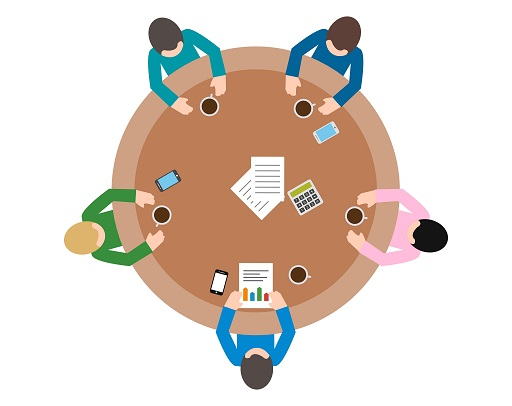

# 2. Partnerschaftliche Zusammenarbeit

 [^6]

**In Kürze**

-   bei Lernraumprojekten ist es notwendig
    schon relativ früh eine große Breite an Akteuren und Akteurinnen einzubeziehen

-   Modell für die Art der Beteiligung, die ein
    Projekt erreichen will

-   Überblick über einige Techniken, um effektive
    Stakeholder-Beteiligung zu erreichen

**Erwartungen an die Lektüre dieses Abschnitts**

Fachleute, die mit der Leitung eines Lernraumprojektes beauftragt sind,
müssen unter Umständen mit einer Reihe von Stakeholdern aus
verschiedenen funktionalen Bereichen zusammenarbeiten, die außerhalb
ihrer täglichen Arbeitspraxis liegen. Das UK Toolkit konzentriert sich
darauf, denjenigen, die für die Verwaltung der Hochschulgebäude, der
IT-Infrastruktur und der audiovisuellen Technik verantwortlich sind,
dabei zu helfen, effektiv zusammenzuarbeiten. Dennoch muss man für ein
erfolgreiches Projekt ein viel breiteres Spektrum von Akteuren und Akteurinnen
einbeziehen.

Jeder Beteiligte bringt möglicherweise unterschiedliche Ansichten
über das Projekt mit und diese zu verstehen und abzugleichen braucht
Zeit. Der große Wunsch, Fristen und ein begrenztes Budget einzuhalten,
kann Projektleitungen dazu veranlassen, den (Um-)Bau voran zu treiben und
noch ausstehende Fragen später klären zu wollen. Dieser Abschnitt soll
aufzeigen, wie wichtig es ist sicherzustellen, dass Stimmen von
Stakeholdern, wie Wissenschaftlichem Personal, Studierenden und
Support-Personal, von Anfang an gehört und bedacht werden um
kostspielige Fehler zu vermeiden.

Vorschläge im Einzelnen:

-   Projektteams sollten einen stark partizipatorischen Ansatz für die
    Beteiligung von Interessengruppen anstreben, statt nur symbolisch
    Informationen weiter zu geben.

-   Designer/-innen sollten darauf achten kreative Denkprozesse anzuregen, wenn
    wir davon weg kommen wollen einfach neue Versionen von Dingen zu
    erschaffen, die wir schon haben.

-   Es gibt viele einfach Ansätze, die genutzt werden können, um
    Stakeholder dabei zu unterstützen ihre jeweiligen Standpunkte zu
    verstehen und zusammen zu arbeiten um bessere Entscheidungen zu
    treffen.

---

[^6]: Meeting Vektor-Grafik von [Vecteezy](https://de.vecteezy.com/gratis-vektor/meeting)
