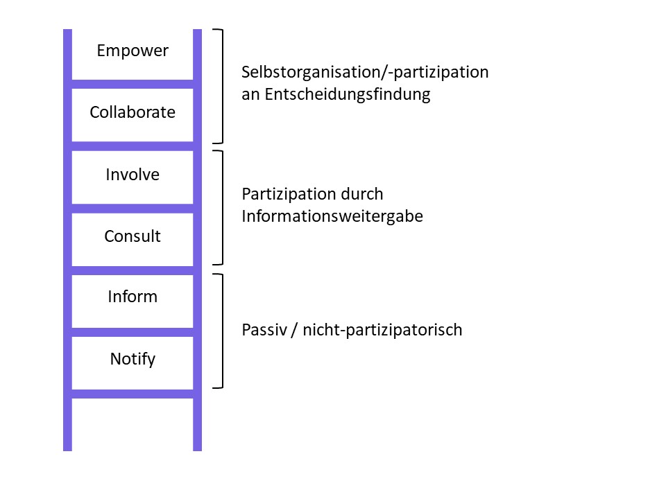

## 2.2 Partizipation managen 

Es ist wichtig, festzulegen welchen Grad an Beteiligung das Projekt für
jede Stakeholder-Gruppe anstrebt, um eine effektive Strategie zur
Gewährleistung dieser Partizipation zu entwickeln und umzusetzen. Ein
hilfreicher Ausgangspunkt ist das Konzept einer
Partizipationsleiter[^7], welches breit eingesetzt und für viele
Kontexte angepasst wurde, seit es zum ersten Mal von 1969 von Arnstein
eingeführt wurde. Die vereinfachte Version aus dem [UK Toolkit](../11_Referenzen.md) wurde adaptiert aus Arbeiten
an der Birmingham City University.

Abbildung 1. Eine Darstellung der von der Birmingham City University
adaptierten Version von [Arnsteins (1969)](../11_Referenzen.md) Partizipationsleiter (übersetzt und adaptiert aus dem [UK Toolkit](../11_Referenzen.md), lizenziert unter [CC BY-NC 4.0](https://creativecommons.org/licenses/by-nc/4.0/deed.de)).

Auch wenn die Leiter hierarchisch angelegt ist (mit jeder Stufe steigt
der Grad der Partizipation an), ist es nicht notwendigerweise in jedem
Projekt angemessen oder wünschenswert auf den höchsten Grad der
Partizipation abzuzielen. Ein Lernraumprojekt erfordert einen Grad an
zentraler Koordination, das bedeutet, es wäre unrealistisch zu erwarten,
dass Stakeholder die volle Verantwortung für das Projekt übernehmen und
sich selbst organisieren. Auf der anderen Seite, ist die Beteiligung der
Interessensvertretungen von großer Bedeutung für den Erfolg des Projektes
und es ist wichtig „Alibipolitik“ zu vermeiden, bei der Stakeholder nur
über schon getroffene Entscheidungen informiert werden oder bei der das
Projektteam keine ausreichend breite Menge von Sichtweisen hört oder
versteht um angemessene Entscheidungen zu treffen. Lernraumprojekte
befinden sich daher eher am oberen Ende der Leiter.

Die folgende Tabelle stellt etwas detaillierter jeden Ansatz und die
Mittel dar, die genutzt werden können um den jeweiligen Grad an
Mitwirkung zu erreichen. Das Projektteam muss auch klarstellen, ob es
versucht denselben Grad der Mitwirkung von allen Stakeholdern zu
erreichen oder ob es Unterschiede zwischen verschiedenen Kategorien von
Stakeholdern machen will.

| Grad der Partizipation           | Merkmale des Ansatzes                                                                                                                                                | Mittel zur Mitwirkung                                                                    |
|----------------------------------|----------------------------------------------------------------------------------------------------------------------------------------------------------------------|------------------------------------------------------------------------------------------|
| 6\. Empower (Ermächtigen)        | Stakeholder setzen sich ihre eigenen Ziele/ Agenda und organisieren/managen sich selbst                                                                              | Allgemein nicht anwendbar bei dieser Art von Projekt                                     |
| 5\. Collaborate (Zusammenarbeit) | Entscheidungen werden partnerschaftlich mit den Stakeholdern getroffen                                                                                               | Stakeholder-geleitete Beratung, Stakeholder in Leitungsgruppe                            |
| 4\. Involve (Beteiligen)         | Zusammenarbeit um sicherzustellen, dass Standpunkte gehört und verstanden werden. Entscheidungen sind hauptsächlich in der Hand des Projektteams                     | Zusammen durchgeführte Workshops, Fokusgruppen, Abstimmungen                             |
| 3\. Consult (Konsultieren)       | Ziele/Agenda hauptsächlich von Projektteam gesteckt. Stakeholder-Sicht aktiv erbeten.                                                                                | Workshops, Fokusgruppen, Interviews, Befragungen                                         |
| 2\. Inform (Informieren)         | Stakeholder werden regelmäßig mit kontextualisierter Information versorgt und auf Wege der Partizipation im Projekt aufmerksam gemacht. Dialog wird implizit begrüßt | Blog mit Kommentarfunktion, Mailingliste, Twitternutzung                                 |
| 1\. Notify (Benachrichtigen)     | Stakeholder sind passive Empfänger von (größtenteils kontextlosen) Informationen                                                                                     | Statische Webseite, zur Verfügung gestellte Protokolle, ungezielte Öffentlichkeitsarbeit |

Auch sollte man nicht unterschätzen, dass die Logistik eine
gewinnbringende Partizipation von Stakeholdern unterstützen kann. Das
[US Toolkit](../11_Referenzen.md) schlägt dafür u.a. vor, Räumlichkeiten für Workshops so
auszuwählen und auszustatten, dass sie für die Workshop-Aktivitäten
geeignet sind (Whiteboard, Marker). Veranstaltungsorte sollten mit
geeigneter Veranstaltungstechnik ausgestattet, um die Sitzung zu
unterstützen. Essen (Catering) ist eine simple Möglichkeit, um für die
Teilnahme zu motivieren. Frühstücks- und Mittagsverpflegung während der
Sitzungen sind eine gute Möglichkeit, die Zeit der Teilnehmenden zu
maximieren und Gemeinschaft aufzubauen.

---

[^7]: Weitere Infos sowie nützlicher Hintergrund zum Konzept der
    Partizipationsleiter:
    <https://www.bipar.de/das-konzept-der-partizipationsleiter/>
