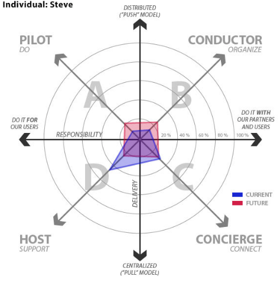

### 6.2.1 Service Plot

*Was ist die eigene Servicephilosophie?*

HINWEIS: Das Tool ServicePlot ist Teil des Learning Space Toolkit US
([Link zu Tool im Original](https://learningspacetoolkit.org/services-and-support/serviceplot/index.html)),
steht aber aufgrund technischer Änderungen nicht mehr auf der Webseite zur
Verfügung. Es wird deshalb hier nur kurz beschrieben und auf Alternativen
verwiesen.

**ServicePlot** ist ein Tool für Organisationen, um ihre
Servicephilosophie zu erkennen und sich, basierend auf ihren Werten und
Nutzerbedürfnissen, ihre zukünftige Philosophie vorzustellen. Dieses
Tool beinhaltet zwei Hauptfaktoren, die Organisationen auf einem
Spektrum unterschiedlicher Philosophien positioniert, ja nach ihren
Antworten:

-   Verantwortlichkeit: Wofür übernimmt die Organisation Verantwortung
    in Bezug auf Bereitstellen oder Erbringen von Serviceangeboten – von
    der Übernahme der vollen Verantwortung auf der einen Seite hin zu
    der Zusammenarbeit mit Partnern und Nutzern selbst (z.B.
    Selbstbedienung) auf der anderen.

-   Angebot: wie und wo werden Services angeboten – mit einem verteilten
    „Push“-Modell auf der einen Seite und einem zentralisierten „Pull“
    Modell auf der anderen

Abbildung 5. Beispiel für einen ausgefüllten ServicePlot, übernommen aus dem [US Toolkit](../11_Referenzen.md), lizenziert unter [CC BY 2.0](https://creativecommons.org/licenses/by/2.0/deed.de)

Dafür bilden Organisationen ihre aktuellen und zukünftigen Antworten bezogen
auf sechs Schlüsselthemen ab – Service-Schwerpunkt,
Organisationsstruktur, Schlüsselqualifikationen der Mitarbeiter,
Angebot, Einstellung, Erfolgskriterien. Die daraus resultierende
Darstellung vermittelt ein Bild davon, wo man steht und wo man mit
seinem Service-Angebot hin will. ServicePlot ist nicht als ultimatives
diagnostisches Werkzeug gedacht, sondern eher als Leitfaden zum
Nachdenken und Diskutieren darüber, was die Service-Philosophie momentan
ist und was man sich wünscht – wobei die notwendigen Veränderungen
hervorgehoben und Gespräche auf dem Weg dorthin erleichtert werden.
Einmal festgelegt, können Organisationen ihre Service-Philosophie
nutzen, um ihre Entscheidungsfindungen darüber, welcher Service wo,
wann, wie und durch wen angeboten werden, zu leiten.

**Weitere Ressourcen zum Erarbeiten einer Vision**

-   [Auswahl von Tools](http://www.upyourservice.com/learning-library/customer-service-vision) von UpYourService

-   Einführung von Mindtools zu [Writing Vision and Mission Statements](http://www.mindtools.com/pages/article/newLDR_90.htm)
