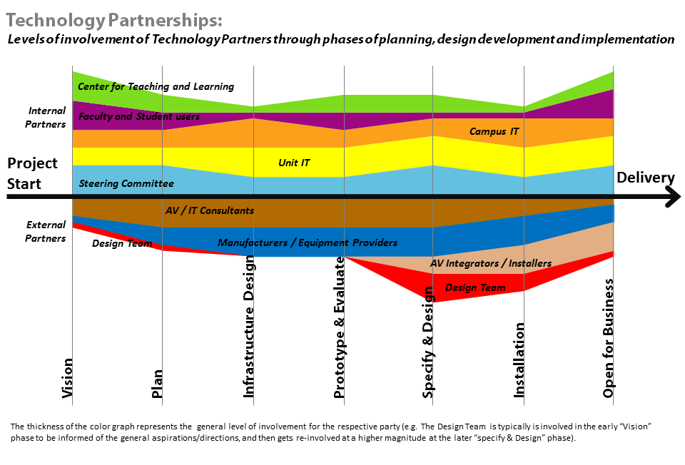

# 5.4 Technologiepartner und -partnerinnen einbinden

Die Gestaltung von Technologie für Lernräume erfordert die
Zusammenarbeit einer Vielzahl von internen und externen Partnern und Partnerinnen. Dazu
gehören traditionelle IT-Supporteinheiten (Campus-IT und das IT-Personal
der Einrichtung), akademische Beteiligte (Dozierende, Studierende und
Lehrtechnikfachleute) und externe Beteiligte (Technikberatende, Integratoren
und Geräteherstellfirmen). Um erfolgreich zu sein, muss man sich darüber im
Klaren sein, über welche Teile des Prozesses und der Infrastruktur jeder
dieser Beteiligten verfügt, wann man sie einbinden sollte und wie man am
besten mit ihnen zusammenarbeitet. Naturgemäß müssen Kooperationen
über lange Zeiträume (Monate oder Jahre) durch viele verschiedene Phasen
und Ebenen des Engagements aufrechterhalten werden. Die Kunst der
Kooperation besteht in der Fähigkeit, dieses Konzept an die
Sichtweise, die Ziele und die aktuellen betrieblichen Belange der
einzelnen Beteiligte anzupassen, damit sie weiterhin in das Projekt
investiert bleiben.

 

**Interne Partnerschaften**

| **Partnerschaft**                      | **Rollen**                                                                                                                                                                                                                                                                                                                                                                                                                                                        | **Was man wissen sollte**                                                                                                                                                                                                                                                                                                                                                                                                                                                                                                                                                              | **Wann einbeziehen**                                                                                                                                                                                           |
|----------------------------------|-------------------------------------------------------------------------------------------------------------------------------------------------------------------------------------------------------------------------------------------------------------------------------------------------------------------------------------------------------------------------------------------------------------------------------------------------------------------|----------------------------------------------------------------------------------------------------------------------------------------------------------------------------------------------------------------------------------------------------------------------------------------------------------------------------------------------------------------------------------------------------------------------------------------------------------------------------------------------------------------------------------------------------------------------------------------|----------------------------------------------------------------------------------------------------------------------------------------------------------------------------------------------------------------|
| Lenkungs-ausschuss               | Der Lenkungsausschuss stellt Ressourcen für Projekte zur Verfügung und sorgt während des gesamten Projekts für Fürsprache auf Campusebene. Seine Unterstützung ist entscheidend für die Verwirklichung der Technologievision, und eine effektive Kommunikation und Einbindung dieser Gruppe während der gesamten Visions- und Designphase ist wichtig. Dies ist die Gruppe, die die Bereitstellung von Ressourcen während der Prototypisierungs-Phase ermöglicht. | Wie Entscheidungen getroffen werden, was die „heiligen Kühe“ sind, wie die Organisation geschäftlich und kulturell strukturiert ist und wie dies die verschiedenen Phasen des Entwurfs und der Konstruktion des Gebäudes beeinflussen wird. Das Timing ist entscheidend - man muss wissen, wann man Ideen, Vorschläge oder Lösungen präsentiert und wann man warten oder sich zurückziehen muss. Wissen, wie man Daten zur Verfügung stellt, welche Formate bevorzugt werden, wie man komplexe Informationen und Szenarien in kompakte, schnell verständliche Präsentationen verpackt. | Das Engagement und die Unterstützung der Verwaltung ist während des gesamten Projekts unerlässlich.                                                                                                            |
| IT-Team der Einrichtung          | Das IT-Team der Einrichtung wird für die Überwachung der Implementierung und die Betreuung der Technologieräume verantwortlich sein. In der Regel ist die Projektverantwortliche Technologiefachkraft in der IT-Abteilung der Einrichtung tätig. Ist sie woanders angesiedelt, halten die Technologiefachkraft und das Projektmanagement das IT-Personal während des gesamten Projekts auf dem Laufenden und sind mit ihm verbunden.                                                                     | Welche Fähigkeiten und Kapazitäten in der lokalen IT-Abteilung vorhanden sind, welche Art von Dienstleistungen sie erbringen, wie weit sie sich für die Übernahme neuer Technologien und Verantwortlichkeiten bezüglich des Projekts entwickeln können. Welche Optionen gibt es für Dienste, die abgeschafft oder umgestellt werden können, um den Arbeitsaufwand oder die Kosten zu reduzieren. Die Kultur der IT-Einheit kennen lernen und die effektivste Art und Weise bestimmen, wie man mit ihr und nicht gegen sie arbeiten kann.                                               | Es kann schwierig sein eine Balance zu finden. Zwischen Entwurfs- und Spezifikations-phase, wenn die IT-Abteilung nicht bereit ist, zur Visionsphase beizutragen. Es muss Überzeugungsarbeit geleistet werden. |
| Campus IT                        | Die IT der Universität verwaltet die zentrale Infrastruktur, z.B. das Netzwerk, und ist verantwortlich für Richtlinien und zentrale Dienste, die Lernräume betreffen (z.B. Sicherheit, Authentifizierung, Drucken, Dateidienste). Das zentrale IT-Personal kann das Fachwissen vor Ort ergänzen.                                                                                                                                                                  | Das Gleichgewicht zwischen zentraler und verteilter IT in der Einrichtung verstehen, wie die Verwaltungsstruktur der IT aussieht, welche Ausschüsse wichtig sind, wie Geld verteilt wird, wie Entscheidungen auf Campusebene getroffen werden, wer die wichtigen Akteure und Akteurinnen für informelle Beziehungen sind.                                                                                                                                                                                                                                                                              | Zu Beginn des Projekts, während der Planungs- und Designphase, und später im Projekt, während der Umsetzungsphase.                                                                                             |
| Dozierende und Studierende | Dozierende und Studierende sind als Nutzende von Lernräumen beteiligt. Sie können die Räume selbst nutzen oder indirekt durch Unterrichtsaufgaben, die die Technologie in den Lernräumen nutzen.                                                                                                                                                                                                                                                              | Es sind keine technischen Kenntnisse erforderlich, aber es ist im Allgemeinen gut, eine Mischung von Nutzenden einzuladen, sowohl technikbegeisterte als auch diejenigen ohne fortgeschrittene Technologiekenntnisse                                                                                                                                                                                                                                                                                                                                                                     | Zu Beginn des Projekts, während der Bedarfsanalyse und nach der Durchführung des Projekts zur Evaluierung                                                                                                      |
| Dezernat für Lehren und Lernen   | Das Dezernat für Lehren und Lernen befasst sich mit Anwendungsfällen, in Bezug auf Lehren und Lernen. Sie können ein breites Spektrum von Nutzenden der Lernräume repräsentieren und zu aktuellen und zukunftsweisenden Technologien beraten. Sie verwalten in der Regel das Learning Management System sowie Technologien für den Unterricht, wie z.B. "intelligente" Unterrichtsräume, Klicker, Videokonferenzen und verwandte Technologien.                    | Welchen Teil der Lehrenden/ Studierenden bedienen die Beschäftigten, was sind die Hauptdienstleistungen, wie ist die Beziehung zu zentralen IT-Systemen und zur Budgetierung, wo liegt die Kernkompetenz in Bezug auf Bildungstechnologie, welche Art von Zusammenarbeit war in der Vergangenheit erfolgreich, wie ist ihre Beziehung zu Lehrenden.                                                                                                                                                                                                                                     | Zu Beginn des Projekts, während der Visionsphase und erneut in der Prototypisierungs-phase.                                                                                                                    |

 

**Externe Partnerschaften**

|  **Partnerschaften**                      | **Rollen**                                                                                                                                                            | **Wann einbeziehen**                                                                                                                                                                                                                               |
|-----------------------------------|-----------------------------------------------------------------------------------------------------------------------------------------------------------------------|----------------------------------------------------------------------------------------------------------------------------------------------------------------------------------------------------------------------------------------------------|
| AV / IT-Beratung                   | AV-/IT-Beratung identifiziert spezifische Technologielösungen, Strategien und Produkte, die auf die Anforderungen und den lokalen Technologiekontext abgestimmt sind. | Sie wird während des Spezifikations- und Installationsprozesses eingebunden. Nach der Eröffnung arbeitet sie mit an der Fehlerbehebung und der Anpassung der Ausstattung, während die Nutzenden damit arbeiten und Probleme identifiziert werden. |
| Hersteller/ Ausstattungs-anbietende | Hersteller/Ausstattungsanbietende beraten zu Lösungen und liefern die Ausstattung.                                                                                      | Prototypisierungs-Phase.                                                                                                                                                                                                                           |
| AV-Integration/ Installateure    | AV-Integration/Installateure installieren und integrieren alle AV-Komponenten in einem Raum.                                                                         | Sie werden während des Spezifikations- und Installationsprozesses eingesetzt. Nach der Eröffnung arbeiten sie mit an der Fehlerbehebung und der Anpassung der Ausstattung, während die Nutzenden damit arbeiten und Probleme identifiziert werden.  |
| Design-Team                       | Das Design-Team arbeitet an Möbeln, Beleuchtung und Oberflächen für Räume und kann auch in der Visions-phase des Projekts beteiligt sein.                              | Es wird während der Entwurfs-, Spezifikations- und Installationsphase der Infrastruktur eingebunden, um Optionen für die Technologieintegration in die Möbel und Integrationsfragen wie Kabelmanagement zu prüfen.                              |
| Spender/-innen                           | Spender/-innen haben oft eine Vision und Erwartungen an das Projekt und stellen möglicherweise beträchtliche Summen zur Verfügung.                                           |                                                                                                                                                                                         
