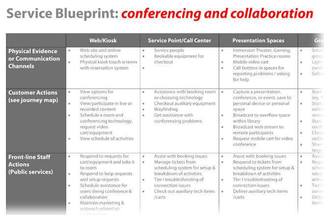

## 6.2.5 Servicekonzept (Blueprint) {#_6.2.5}

Ein Servicekonzept (Blueprint = „Blaupause“) ist ein operatives
Planungsinstrument für die Bereitstellung eines Dienstes, in dem die
physischen Gegebenheiten, die Aktivitäten des Personals und die
Unterstützungssysteme/Infrastruktur festgelegt werden, die für die
Bereitstellung des Dienstes über seine unterschiedlichen Kanäle
erforderlich sind. Um beispielsweise zu planen, wie man Geräte an
Benutzer ausleiht, würde ein Servicekonzept helfen, zu bestimmen, wie
dies am Serviceschalter geschieht, welche Arten von Wartungs- und
Support-Aktivitäten hinter den Kulissen erforderlich sind, wie die
Benutzer über die verfügbaren Geräte informiert werden, wie diese ein-
und ausgecheckt werden und mit welchen Mitteln die Benutzer im Umgang
mit dem Gerät geschult werden.

Servicekonzepte können verschiedene Formen annehmen - einige sind
grafischer als andere - aber sie sollten die verschiedenen Mittel/Kanäle
aufzeigen, über die die Dienste bereitgestellt werden, und die
physischen Gegebenheiten des Dienstes, die Aktivitäten der
„Front-Line“-Mitarbeiter und hinter den Kulissen und die Supportsysteme
aufzeigen. Sie werden in einem iterativen Prozess vervollständigt - in
einem ersten Durchgang, in dem Erkenntnisse aus Personas, Journey Maps
und der Standortplanung berücksichtigt werden, anschließend wird der
Plan wieder aufgegriffen, um ihn im Laufe der Zeit zu verfeinern. Häufig
werfen die Konzepte Fragen auf, die nicht ohne weiteres beantwortet
werden können und daher prototypisch getestet werden müssen, z.B. durch
Durchspielen einer Interaktion oder Mock-up eines Produkts. Im
Allgemeinen sollte für jeden zentralen Service ein Konzept erstellt
werden, ggf. mit jeweils angepasstem Detailgrad.

**Beispiel und Tool**

[Download Beispiel Service Blueprint (docx)](media/tools/DE_Service_Blueprint_Beispiel.docx){: .btn .btn-purple .fs-5 .mr-4}

[Download Template Service Blueprint (docx)](media/tools/DE_Service_Blueprint.docx){: .btn .btn-purple .fs-5 .mr-4}

**Weitere Ressourcen Konzepterstellung/Blueprinting**

-   [Überblick über Tool](http://www.servicedesigntools.org/tools/35) mit Beispielen von Service Design Tools

-   Überblick auf dem [Desonance Blog](http://desonance.wordpress.com/2010/06/16/service-blueprinting/)

-   Harvard Business Review Article: Shostack, L. G. (1984). Design Services that Deliver. Harvard Business Review(84115), 133-139. [Link zu Artikel](https://hbr.org/1984/01/designing-services-that-deliver)

-   Scott W. H. Young, Sara Mannheimer, Doralyn Rossmann, David Swedman & Justin D. Shanks (2020) Service Blueprinting: A Method for Assessing Library Technologies within an Interconnected Service Ecosystem, Public Library Quarterly, 39(3), 190-211. doi: [10.1080/01616846.2019.1637222](https://doi.org/10.1080/01616846.2019.1637222)

-   Im allgemeinen Überblick über Qualitätsmanagement des Bibliotheksportals gibt es einen [Abschnitt zu Service-Blueprinting](https://bibliotheksportal.de/ressourcen/management/marketing-baukasten/strategisches-marketing/qualitaetsmanagement/).

**Weitere Ressourcen Prototyping**

-   [Service Prototyping Overview](http://issuu.com/flandersdc/docs/091028-make-it-happen-service-prototyping-v1) in einer Präsentation von Möbius

-   [Service Prototpying Overview](https://uxplanet.org/a-brief-guide-to-service-prototyping-fc0cdf8a1a8e) von UX Planet

-   [Video](http://vimeo.com/15969083) von Beyond Roleplay: Theatrical Tools in Service Design
