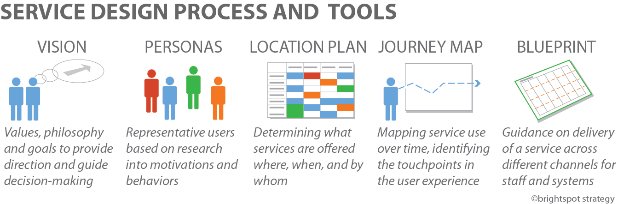

# 6.2 Service Design Prozess

Die Gestaltung von Serviceangeboten innerhalb von Lernräumen erfordert
eine spezielle Denkweise und Tools. Das bedeutet, dass man zunächst die
Nutzer und deren Bedürfnisse berücksichtigt, ganzheitlich plant, die
gesammelten Erfahrungen rechtzeitig durchdenkt und iterativ zwischen den
einzelnen Schritten und Tools arbeitet.

Die Service Design Tools, die dieser Lernraum-Toolkit beinhaltet, sind:

-   [ServicePlot](#_6.2.1) um die eigene Service Philosophie, Wert
    und Vision zu verstehen

-   [Personas Overview](#_6.2.2) um die Motivationen und
    Verhalten der Nutzer darzustellen

-   [Service Location Planner](#_6.2.3) um festzulegen
    welche Services wo, wann und durch wen angeboten werden

-   [Customer Journey Map](#_6.2.4) um die Nutzung von Service/Raum
    über die Zeit aufzuzeichnen und Zeiten der Interaktion oder
    “Berührungspunkte” zu identifizieren.

-   [Service Blueprints](#_6.2.5) zur Orientierung,
    wie sowohl „Front-Line“-Mitarbeiter als auch diejenigen hinter den
    Kulissen Service durch verschiedene Kanäle anbieten werden

Zusammengenommen können diese Tools iterativ genutzt werden, um sich
immer wieder gegenseitig zu ergänzen. Zum Beispiel, wenn man einmal
seine Zukunftsvision entwickelt hat, kann man Journey Maps für Personas
erstellen um diese Vision zu veranschaulichen, um daraus wiederum
Erkenntnisse für die Servicekonzepte zu ziehen. Auf dem Weg dorthin wird
man sich immer wieder hin und her bewegen – etwa durch die Pläne etwas
dazulernen, dass einen dazu veranlasst eine neue Journey Map zu
erstellen, ein neues Service Angebot aufzubauen und auszuprobieren oder
sogar seine Vision zu überdenken. Die zu Verfügung gestellten Ressourcen
bieten weitere Einblicke in diese Werkzeuge und wie sie zusammenspielen.
